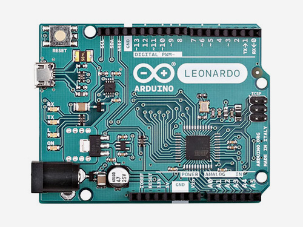
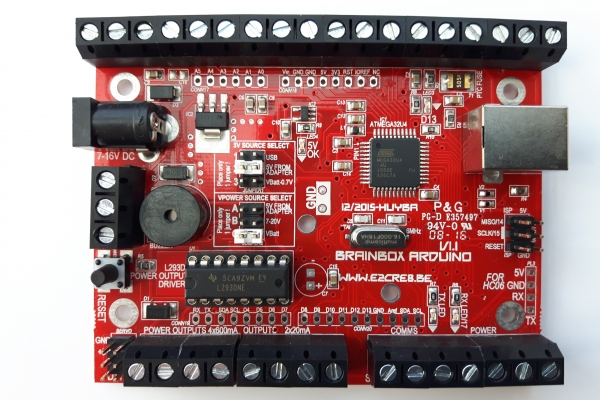
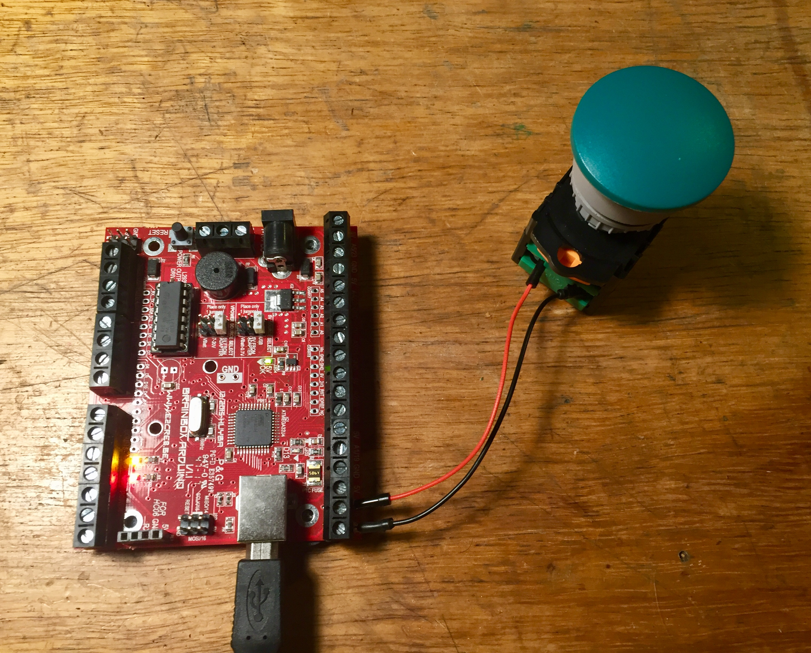

# Maak zelf een keyboard met een Arduino

Voor [Team Scheire](https://www.canvas.be/team-scheire) gaven we de rolstoel van Lazlo een upgrade. Met een Arduino (Leonardo) maakten we een speciale game controller, op maat van zijn rolstoel en zijn unieke kunden.

In deze repository leggen we uit hoe je zelf een Arduino met knoppen kan gebruiken als een toetsenbord, om er bijvoorbeeld games mee te spelen.

We maken een programma waarmee we 9 knoppen kunnen aansluiten om zo de getallen 1 tot 9 op het numerieke klavier van ons toetsenbord met onze eigen knoppen te kunnen bedienen.

## Wat heb je nodig?

Het belangrijkste is een [Arduino Leonardo](https://www.arduino.cc/en/Main/Arduino_BoardLeonardo). In tegenstelling tot een gewone Arduino (Uno) is de Leonardo speciaal gemaakt om je eigen toetsenborden, muizen of joysticks te bouwen. Je kan het gebruiken als een zogenaamd "HID" (Human Interface Device). Verder is de Leonardo helemaal hetzelfde als een andere Arduino en kan je er precies dezelfde dingen mee doen.

Je kan ook een bord gebruiken dat een clone is van de Arduino Leonardo, zoals de [Brainbox Arduino](https://e2cre8.be/?page_id=21), die extra grond- en voedingspinnen heeft en ook handige schroefconnectors heeft.

Verder heb je knoppen nodig. Met een USB kabel en kabeltjes om de knoppen aan de Arduino te bevestigen ben je helemaal klaar. Er zijn geen weerstanden nodig, omdat de pinnen van de Arduino een zogenaamde "pull-up" weerstand op hun pinnen hebben.

## Hoe werkt het?

We sluiten op 9 pinnen (analoge pinnen A0 tot A5 en digitale pinnen 0 tot 2) een knop aan. Tien keer per seconde lezen we de waarde van deze knoppen uit. Als een knop ingedrukt wordt, geeft de Arduino Leonardo dit door alsof een knop wordt ingedrukt op het numerieke klavier, en als we de knop weer loslaten, dan geeft de Leonardo dit ook door.

## Constructie

Verbind elke knop aan één van de input pinnen en aan GND (ground). In de foto hieronder is enkel een knop aangesloten tussen A0 en GND (deze zal de 1 op het numerieke klavier simuleren):

## Code

* Download deze GitHub repository en open `lazlocontroller.ino` met de Arduino software.
* Zorg dat je Arduino Leonardo kiest onder `Tools/Board`
* Controleer of de juiste poort geselecteerd is onder `Tools/Port`
* Compileer en upload de firmware naar de Arduino Leonardo

Als je nu je de knoppen indrukt, dan zal je zien dat je je Arduino, net als elk ander toetsenbord, kunt gebruiken om te typen op je computer.

## Experimenteer!

* Open je favoriete spel en stel knoppen van je numeriek klavier in om te kunnen spelen, zodat je je zelfgemaakte controller kan gebruiken om te gamen!
* Bestudeer de code en verander ze. ZO kan je bijvoorbeeld lichtjes toevoegen aan de controller die reageren op de knoppen.
* Verander de knoppen, stuur andere karakters door, of stuur ook muiscommando's door, je kan dit met de [Keyboard en Mouse libraries](https://www.arduino.cc/en/Reference.MouseKeyboard) van Arduino.
* Met twee stukjes zilverpapier kan je zelf je eigen knop maken. Welke gekke knop kan je zelf verzinnen?
* Laat je fantasie gaan en bouw je eigen game controller, zoals een volledige vliegtuigcockpit, zodat je net echt je flight simulator kan besturen.
