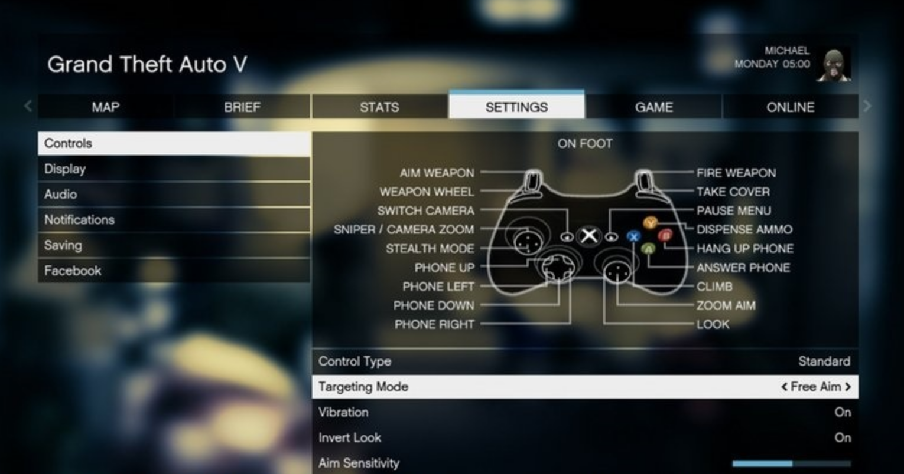
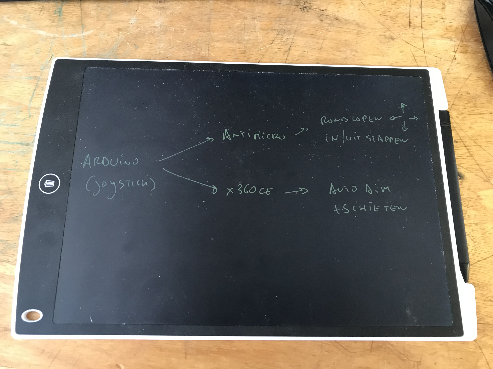
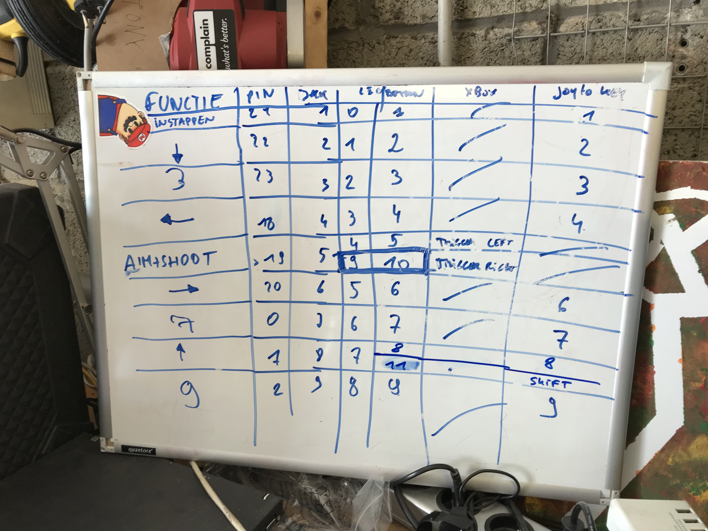

# Source-Code van de controller van Lazlo om GTA V te kunnen spelen 

Het maken van knoppen en schrijven van code was één ding, maar we gingen nog verder om Lazlo auto-aim te geven én de mogelijkheid te geven om te kunnen in- en uitstappen uit een voertuig.

Dit is de code die draait op een [Brainbox Arduino](https://e2cre8.be/?page_id=21) en deze arduino configureert als joystick.

## Waarom als joystick? X360-controller emulator

GTA V op pc biedt de mogelijkheid om een xbox-controller te gebruiken in combinatie met een toetsenbord. Hierbij zit een auto-aim optie als een andere knop eerst ingedrukt wordt.

Via een apart programma [X360ce](https://www.x360ce.com) worden van deze joystick-inputs xbox360 controller inputs gemaakt en kunnen we de auto-aim dus gebruiken door één fysieke knop van de arduino via de code zo te programmeren dat hij eerst de virtuele aim-knop indrukt en 500ms later de virtuele schietknop, krijg je auto-aim.

Via [OpenIV](http://openiv.com/?cat=23) kan je zelfs nog verder gaan en de bronbestanden van GTA V hacken om de range uit te breiden waarbinnen deze auto-aim gebeurt. Wat we uiteraard gedaan hebben voor Lazlo, maar iets te ver gaat voor deze code ;)

## En ook als keyboard

Probleem: de knoppen van de xbox controller in GTA V kan je niet configureren en het in- en uitstappen in een auto is dezelfde knop als de auto-aim.

Oplossing: [antimicro](https://emulationrealm.net/downloads/file/3374-antimicro-windows-64bit) (hier [source-code](https://github.com/AntiMicro/antimicro)) een mapper om joystick-keys naar een virtueel keyboard te mappen.

## samengevat

## conclusie

Heel wat hacks, maar mét resultaat: een maximale spelervaring voor Lazlo in GTA V.